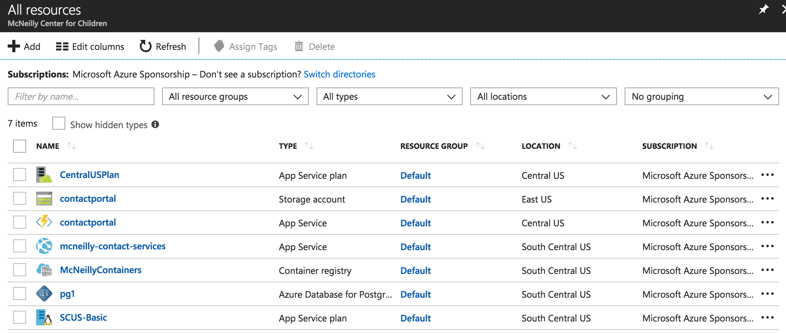
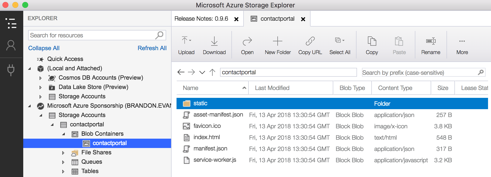
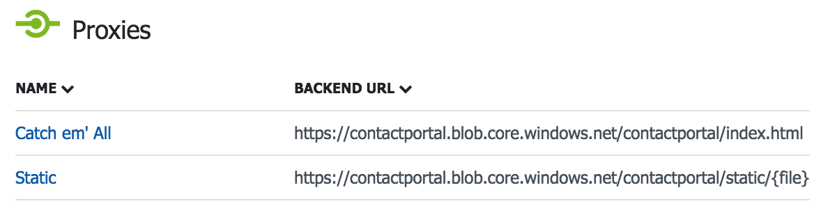

# Teach for America Contact Portal

This is the code repository for the Teach for America 2020 Hack for the Community project. As per the [requirements document](docs/requirements.pdf), this is a "web-based application to collect contact information from parents and staff and communicate important messages via text or email."

## Deliverables

* [Contact Portal Kiosk](https://contactportal.azurewebsites.net/kiosk)
* [Contact Portal Admin](https://contactportal.azurewebsites.net/admin)
* [User Manual](https://docs.google.com/document/d/1WzKxqVB4X0ZY0WIjOFV9N-zojqcNWpJsr8nFgnRBLL0)
* [Finalized User Experience Prototype](https://xd.adobe.com/view/acd638d4-5f38-41bf-6991-bcb7be364ecc-dae7/screen/9fecd7a0-8c42-43ed-8dd6-0bc21f96b145/iPad-3?fullscreen)
* [Trello Board](https://trello.com/b/fozavptf/contact-portal)
* [Test Plan](https://app.hiptest.com/projects/93899)

## Tech Platform
* [Azure](http://portal.azure.com/)
* [Twilio](https://www.twilio.com/)
* [Docker](https://www.docker.com/)
* [React](https://reactjs.org/)
* [Bootstrap](https://getbootstrap.com/)
* [Node.js](https://nodejs.org/)
* [Express](https://expressjs.com/)
* [PostgresSQL](https://www.postgresql.org/)
* [GitHub](https://github.com/)

Azure and Twilio accounts are accessible by shellie.fossick@mcneillycenter.org and martym@mcneillycenter.org.

## Component Documentation

* [Frontend](frontend/README.md)
* [Backend](backend/README.md)

## Security

* The user interfaces and API are **not** behind a VPN. The below precautions were taken to alleviate some of the resulting security concerns.
* All user interfaces and API calls are encrypted in transit.
* In order to access either the kiosk or admin interface, a system administrator must login. All API calls require basic authentication with the administrator's credentials. The password is salted and hashed both on the frontend and backend, meaning that the password is never transmitted or stored in plain-text.
* No credentials are stored in local storage. Whenever the application is refreshed, the administrator must log back in.
* In order to update their information via the kiosk, contacts will have to enter their first name, last name, and PIN. If they are inactive for one minute, their session will end and all data will be cleared.
* Database traffic is encrypted in transit. The database is password protected, not accessible from the public internet, and all data is [encrypted at rest](https://docs.microsoft.com/en-us/azure/postgresql/overview#secure-your-data).

## Deployment Details



### contactportal - Storage account

This contains a static build of the application to be servied by the app service. To update the application, run `npm run build` in the frontend directory, download the [Azure Storage Explorer](https://azure.microsoft.com/en-us/features/storage-explorer/), connect to your Azure account, and upload the contents of `frontend/build` to the `contactportal` container.



### contactportal - App service

This is an application that proxies requests from the public facing user interfaces to the storage account that hosts our user interface builds. We have set up two proxies following [this article](https://blog.cloudboost.io/host-spa-with-azure-functions-62e8b55a23e5):



### McNeillyCD

Webhook enabling continuous deployment to `mcneilly-contact-services` when a Docker image is pushed to `mcneilly/prod:latest`. This should not need modification.

### mcneilly-contact-services

This hosts the backend services in a [Docker container](https://www.docker.com/). You can debug this service [here](https://mcneilly-contact-services.scm.azurewebsites.net/).

```
cd backend
bin/docker build prod
docker login mcneillycontainers.azurecr.io # The username and password can be found in the Azure portal under "Home > McNeillyContainers - Access keys"
docker tag mcneilly/prod mcneillycontainers.azurecr.io/prod:{n} # For a specific version.
docker tag mcneilly/prod mcneillycontainers.azurecr.io/prod:latest
docker push mcneillycontainers.azurecr.io/prod
```

Continuous deployment is enabled, so pushing to the latest tag will redeploy the backend.

### McNeillyContainers

This is a Docker registry containing an image for our backend service.

### pg1

This is a managed [PostgreSQL](https://www.postgresql.org/) instance which is used by our backend services for data persistence.

### CentralUSPlan and SCUS-Basic

These are service plans. They should not need modification.
